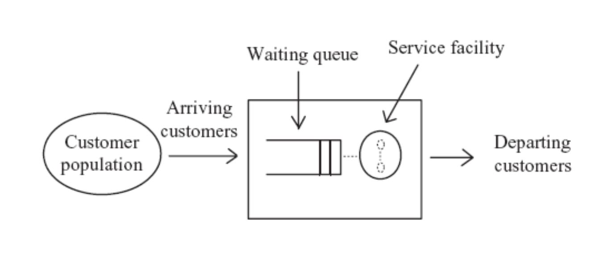
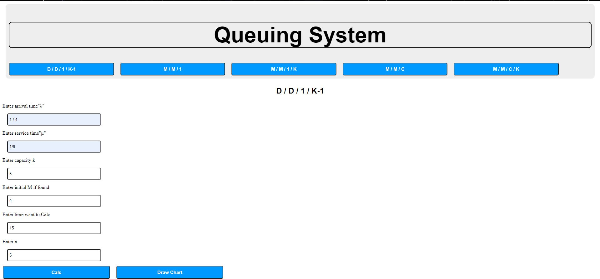
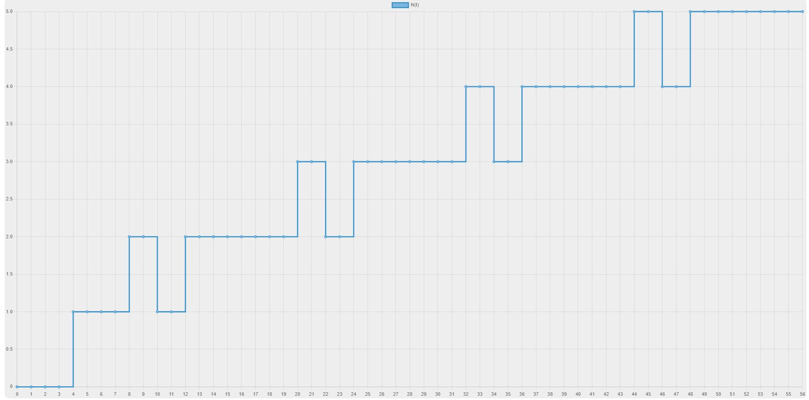
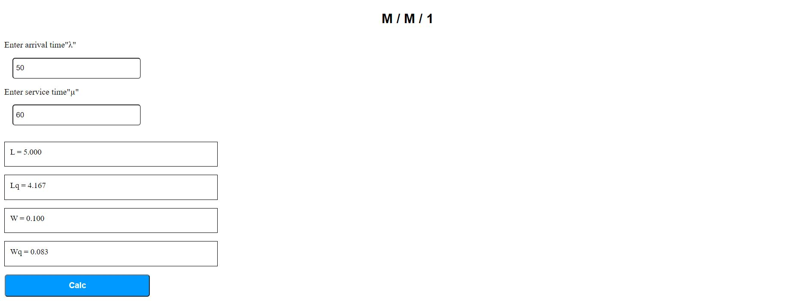
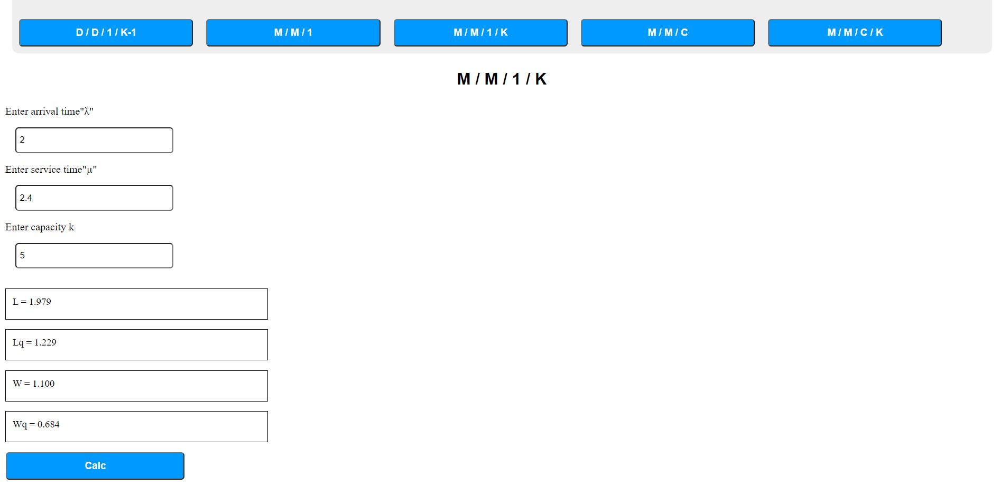
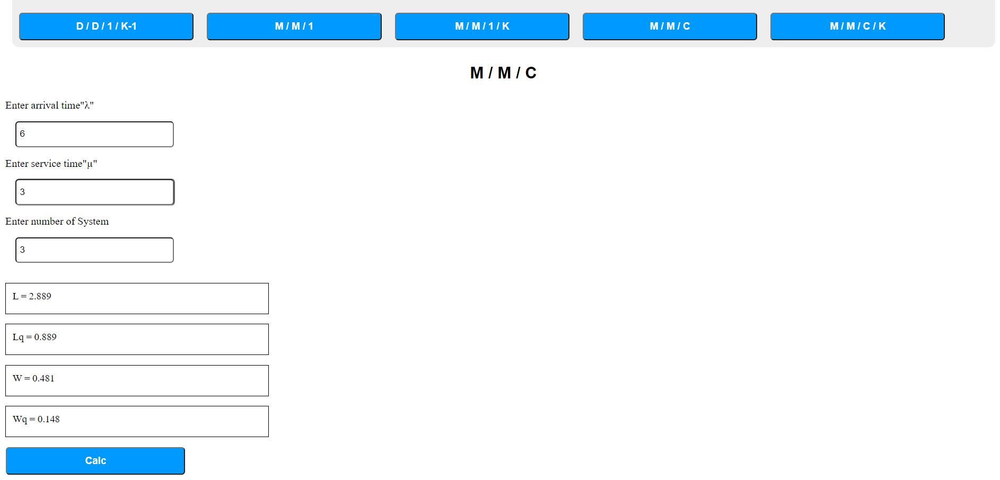
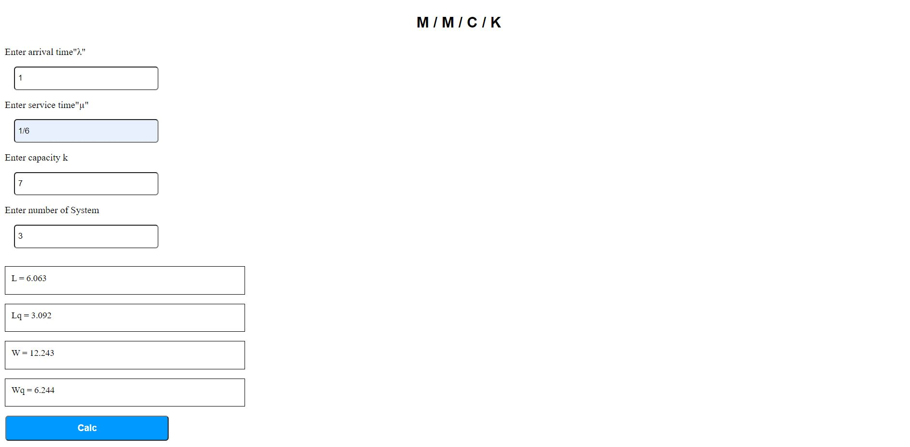

# About Queueing Theory
Sharing of resources and waiting in queues is a common 
phenomenon that occurs in every facet of our lives. 

examples:
- banks/supermarkets waiting for service
- computers waiting for a response

This is the software created for the calculation of characteristics of different queues and visualization for the system behaviour over time for the queuing models.

# Different types of Queueing Models
- DD1K
- MM1
- MM1K
- MMC
- MMCK

It is common to use the symbols:

- λ to be the mean arrival rate.
- µ to be the mean service rate.
  

# Screenshots

Live Screenshots
 

1. 
2. 
3. 
4. 
5. 
6. 

